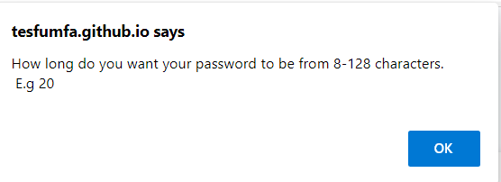
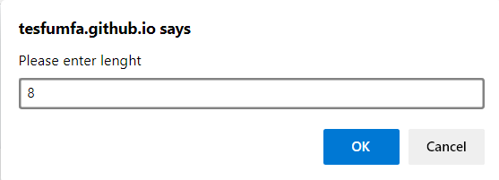
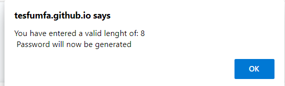
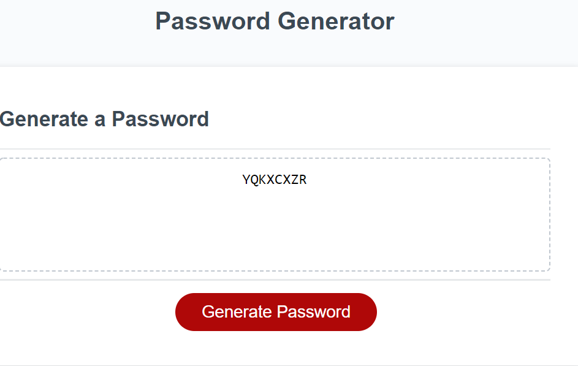

# ass_cha_3
<h1>assignment challenge 3</h1> 
<h2> Description. 
    Web Address. 
    Usage tips. 
    Contributing. 
    License. 
Description:</h2> 
This is a password generator for the javascript challenge print screenshot

 
Desktop screen

 

small device screen

 
<h4>How to Get There</h4>

Open your favorite web browser and enter the following web address to access 

 https://tesfumfa.github.io/ass_cha_3/

 <h2>Usage tips</h2>
Follow the criteria instructions to generate a password matching the criteria selected. 
    Steps to have a successful password generated.
 <h3>Click Generate Password</h3> 
     
    <h3>Possible criteria options</h3>
    <h3>Enter criteria options: enter the integer corresponiding to the option you want.</h3>
    
Leave space between the criteria selected. 
Duplicated values are not allowed. 
Incorrect criteria will cause application to restart. 
If you wish to exit the application, please close the browser tab. 
 
<h3>Read the lenght rules. That is from 8-128 characters. E.g 20.</h3> 

<h3>Enter the desired lenght</h3>
<h3>Lenght selected confirmation</h3>

<h3>End result - test of 8 performed. Copy and paste you password. Note that you cannot type once the password has been provided for security.</h3>

